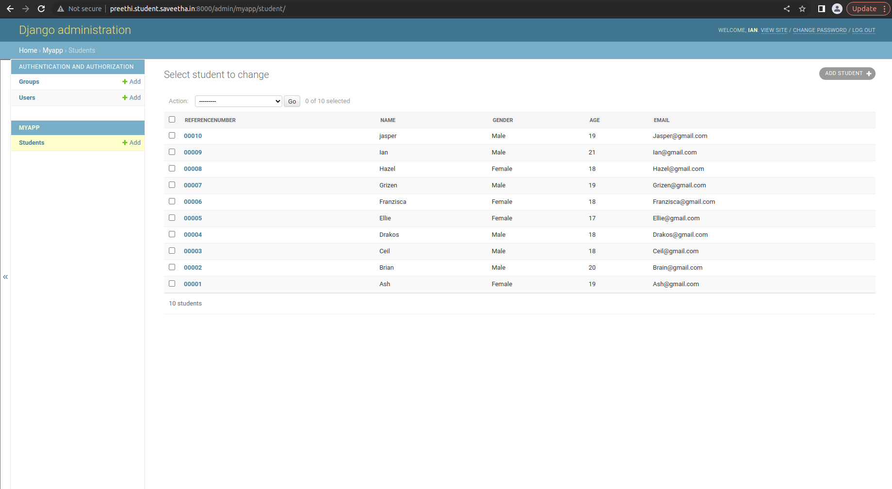
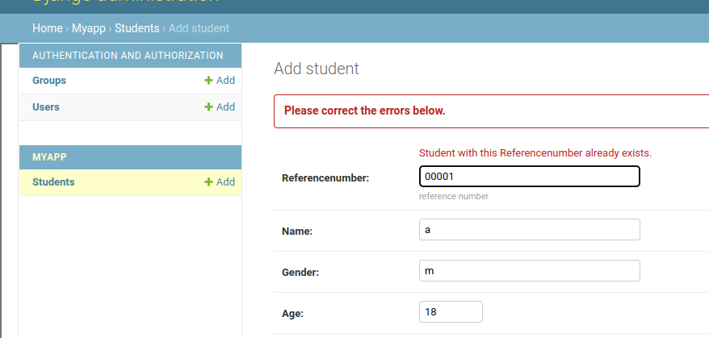
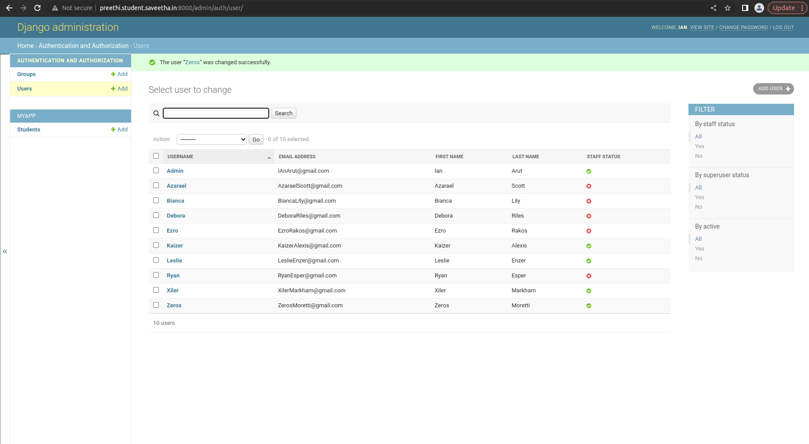

# Django ORM Web Application

## AIM
To develop a Django application to store and retrieve data from a database using Object Relational Mapping(ORM).

## Entity Relationship Diagram

Include your ER diagram here

## DESIGN STEPS

### STEP 1:

   *   Create a local directory and start 'myapp’ .
   *   Make changes to settings.py like 'import os' and'domain address (http://preethi.student.saveetha.in:8000/)                  
   *   Insert ‘myapp’ in the configuration INSTALLED_APPS     
   *   Create folder static/html/index.html
   *   Insert codes and run the server.

### STEP 2:
  *  Create a github repository with README.md and link to the local
      directory(git remote add   origin) and commit the changes.
  *  Create a classic token and use it to push the changes to main branch.
      add the files and commit changes.
  *  Apply migrations to the server and create a superuser with admin
      credentials
  *  Create add users in the webpage with employee status and credentials.
### STEP 3:

   *    Make changes to models.py and admin.py by creating a student class
        with name,email,age,reference no.
   *    Migrate the changes inside myapp to the server.
   *    Add students with credentials in the webpage.

## PROGRAM
### Models.py code
     from django.db import models
     from django.contrib import admin
     class Student (models.Model):
     referencenumber=models.CharField(primary_key=True,max_length=20,help_text="reference number")
     name=models.CharField(max_length=100)
     gender=models.CharField(max_length=50,null=True)
     age=models.IntegerField()
     email=models.EmailField()

     class StudentAdmin(admin.ModelAdmin):
     list_display = ('referencenumber','name','gender','age','email')

### admin.py code
     from django.contrib import admin
     from .models import Student,StudentAdmin

     admin.site.register(Student,StudentAdmin)

## OUTPUT

## RESULT

Django application to store and retrieve data from a database using Object Relational Mapping(ORM) was developed successfully.
